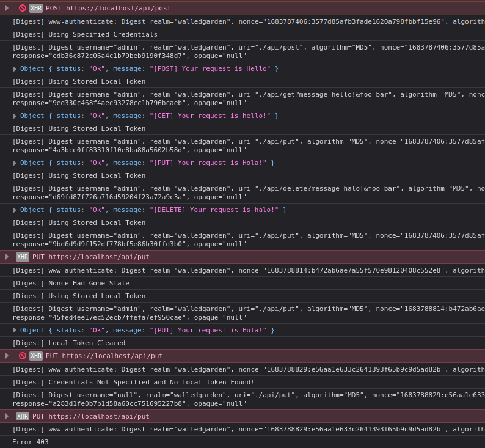

### DigestAuthMemory
--------------------

Javascript implementation of 
[RFC 2716 HTTP Digest Authentication](https://datatracker.ietf.org/doc/html/rfc7616) 
with support for MD5, SHA-256, SHA-512-256, session variant, username hashing, 
stale nonce handler and more.

Adapted from [inorganik/digest-auth-request](https://github.com/inorganik/digest-auth-request).

Forge library from [digitalbazaar/forge](https://github.com/digitalbazaar/forge) is 
required.

----------
### Usage:

#### GET (with username and password defined)
```js
let url = "./api/get";
let getData = "message=hello!&foo=bar";

let req = new digestAuthRequest('GET', url + "?" +  getData, "username", "password");
req.request(function(resp){
    console.log(resp);
},function(errorCode){
    console.log("Error " + errorCode);
});
```

#### POST (send as application/json)
```js
let url = "./api/post";
let postData = {message:'Hello', foo:'bar'};

let req = new digestAuthRequest('POST', url);
req.request(function(resp){
    console.log(resp);
},function(errorCode){
    console.log("Error " + errorCode);
},postData);
```

#### POST (send as application/x-www-form-urlencoded)
```js
let url = "./api/post";
let postData = "message=hello!&foo=bar";

let req = new digestAuthRequest('POST', url);
req.request(function(resp){
    console.log(resp);
},function(errorCode){
    console.log("Error " + errorCode);
},postData);
```

#### Clear digest parameter
```js
let req = new digestAuthRequest();
req.clrLocalToken();
```

--------
### Note

After a successful authentication is performed, the digest parameter is saved in JS 
closures and used for subsequent requests until the page is refreshed or the parameter 
is cleared.



To avoid browser sign in prompt, set your back-end to send a different status code if 
`X-Requested-With: XMLHttpRequest` is being detected for example code 403.
